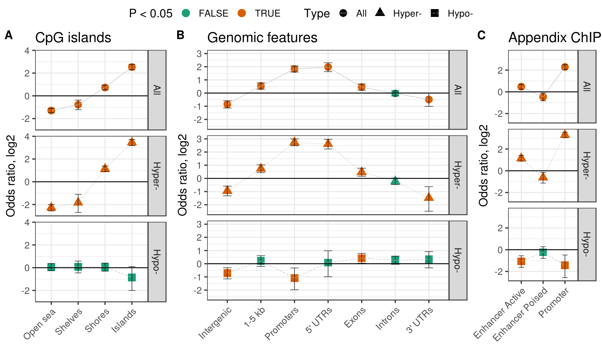

<!-- # (c)  Juozas Gordevičius -->

```{r setup, include=FALSE}
source("../code/common.R")
```

# Stats for Results Section

## Appendix PD vs Controls, Padlocks

```{r}
apx <- fread("../Appendix_PDvsControls_Padlock/www/m6_Appendix_PDvsControls_Padlock.csv")
apd <- readRDS("../Appendix_PDvsControls_Padlock/www/m6_methylation.RDS")
```

```{r, include=TRUE}
message("Number of loci ", nrow(apx))

message("Cases and controls: ")
print(apd$key[, table(Diagnosis)])

message("Number of significant loci ", 
	apx[, sum(adj.P.Val < 0.05, na.rm=TRUE)])

message("Number of genes affects ",
	apx[adj.P.Val < 0.05, length(unique(Gene))])
```

Direction enrichment

```{r, include=TRUE}
apx[, table(adj.P.Val < 0.05, sign(logFC))] %>% tee %>% fisher.test
```

Genomic enrichment

```{r, include=TRUE}
dtlist <- readRDS("../Discover_GenomicEnrichment/enrichment_Appendix_PDvsControls_Padlock.RDS")
dtlist[[1]][Type == "All"]
dtlist[[2]]
```

Enrichment of ALP pathways with DMCs


```{r}

getGoGenes <- function(term) {
  url <- glue("http://golr-aux.geneontology.io/solr/select?defType=edismax&qt=standard&indent=on&wt=csv&rows=100000&start=0&fl=bioentity_name,bioentity,bioentity_label&facet=true&facet.mincount=1&facet.sort=count&json.nl=arrarr&facet.limit=25&hl=true&hl.simple.pre=%3Cem%20class=%22hilite%22%3E&hl.snippets=1000&csv.encapsulator=&csv.separator=%09&csv.header=false&csv.mv.separator=%7C&fq=regulates_closure:%22{term}%22&fq=document_category:%22bioentity%22&fq=taxon_subset_closure_label:%22Homo%20sapiens%22&facet.field=source&facet.field=taxon_subset_closure_label&facet.field=type&facet.field=panther_family_label&facet.field=annotation_class_list_label&facet.field=regulates_closure_label&q=*:*")
  genes <- fread(url, header = FALSE)
  return(genes$V3)
}

pathways <- list(
  list(term="GO:0061912", name="Selective autophagy"),
  list(term="GO:0016236", name="Macroautophagy"),
  list(term="GO:0005764", name="Lysosomes"),
  list(term="GO:0061684", name="Chaperone-mediated autophagy"),
  list(term="GO:0006914", name="Autophagy")
  # list(term="GO:0016237", name="Microautophagy"),
  # list(term="GO:0000423", name="Mitophagy")
  )

pathways <- foreach(p = pathways) %do% {
  p$genes <- getGoGenes(p$term)
  p
}


pd <- foreach(p = pathways, .combine = rbind) %do% {
  genes <- p$genes
  res1 <- apx[, table( adj.P.Val < 0.05, Gene %in% genes)] %>% 
          fisher.test %>%
          broom::tidy() %>%
          setDT %>%
          .[, Term := p$term] %>%
          .[, Name := p$name] %>%
          .[, Type := "Target"] %>% 
          .[, Dir := "All"]
  res2 <- apx[, table( adj.P.Val < 0.05 & logFC > 0, Gene %in% genes)] %>% 
          fisher.test %>%
          broom::tidy() %>%
          setDT %>%
          .[, Term := p$term] %>%
          .[, Name := p$name] %>%
          .[, Type := "Target"] %>% 
          .[, Dir := "Hyper-"]
  res3 <- apx[, table( adj.P.Val < 0.05 & logFC < 0, Gene %in% genes)] %>% 
          fisher.test %>%
          broom::tidy() %>%
          setDT %>%
          .[, Term := p$term] %>%
          .[, Name := p$name] %>%
          .[, Type := "Target"] %>% 
          .[, Dir := "Hypo-"]
  rbindlist(list(res1, res2, res3))
}
if (!dir.exists("www")) dir.create("www")
fwrite(pd, file = "www/enrichment_Pathways_DMCs.csv")
```

```{r, include = TRUE}
pd
```

## Appendix PD vs Controls, RNAseq

```{r}
rna <- fread("../Appendix_PDvsControls_RNAseq/www/r1_Appendix_PDvsControls_RNAseq.csv")
# apd <- readRDS("../Appendix_PDvsControls_RNAseq/www/r1_rnaseq.RDS")
```

```{r, include=TRUE}
message("Number of genes affected ",
  rna[adj.P.Val < 0.05, length(unique(SYMBOL))])
```

The ALP genes tend to be down-regulated


```{r, include=TRUE}
alpGenes <- apx[, unique(Gene)]
rna[, table(SYMBOL %in% alpGenes, adj.P.Val < 0.05 & logFC < 0)] %>%
fisher.test
```


Downregulation of genes belonging to lysosomal pathway

```{r, include=TRUE}
p <- pathways[[3]]
genes <- p$genes
rna[adj.P.Val < 0.05, table(SYMBOL %in% genes, -sign(logFC))] %>% tee %>% fisher.test
```

Enrichment of ALP pathways with DEGs (nominally significant, p < 0.05)

```{r}

pd <- foreach(p = pathways, .combine = rbind) %do% {
  genes <- p$genes
  res1 <- rna[, table( P.Value < 0.05, SYMBOL %in% genes)] %>% 
          fisher.test %>%
          broom::tidy() %>%
          setDT %>%
          .[, Term := p$term] %>%
          .[, Name := p$name] %>%
          .[, Type := "RNA"] %>% 
          .[, Dir := "All"]
  res2 <- rna[, table( P.Value < 0.05 & logFC > 0, SYMBOL %in% genes)] %>% 
          fisher.test %>%
          broom::tidy() %>%
          setDT %>%
          .[, Term := p$term] %>%
          .[, Name := p$name] %>%
          .[, Type := "RNA"] %>% 
          .[, Dir := "Hyper-"]
  res3 <- rna[, table( P.Value < 0.05 & logFC < 0, SYMBOL %in% genes)] %>% 
          fisher.test %>%
          broom::tidy() %>%
          setDT %>%
          .[, Term := p$term] %>%
          .[, Name := p$name] %>%
          .[, Type := "RNA"] %>% 
          .[, Dir := "Hypo-"]
  rbindlist(list(res1, res2, res3))
}
if (!dir.exists("www")) dir.create("www")
fwrite(pd, file = "www/enrichment_Pathways_DEGs.csv")
```

```{r, include=TRUE}
pd
```

# Supplementary figures

## Supp. Fig. Apx 1

```{r, include=TRUE, fig.cap="Enrichment of genomic elements in apx pd vs controls"}

```

## Supp. Fig. Apx 2

```{r, include=TRUE, fig.cap="Enrichment of ALP pathways in apx pd vs controls"}
pd <- rbind(
  fread("www/enrichment_Pathways_DEGs.csv"), 
  fread("www/enrichment_Pathways_DMCs.csv")[, Type := "Methylation"])

ggplot(pd, aes(Name, log(estimate), color = p.value < 0.05)) + 
  geom_point(size = 4) + 
  geom_errorbar(aes(ymin = log(conf.low), ymax = log(conf.high)), size = 0.25, width = 0.25, color = "black") + 
  geom_hline(yintercept = 0) + 
  ylab("OR, log") +
  facet_grid(Type ~ Dir) + 
  theme_bw(base_size = 14) + 
  theme(axis.title.x = element_blank(),
        axis.text.x = element_text(angle = 45, hjust = 1),
        legend.position = "top")
```


# Supplementary tables


```{r}
url <- "../Appendix_PDvsControls_Padlock/www/m6_Appendix_PDvsControls_Padlock.csv"
stopifnot(file.exists(url))
```

- [Supp. table 1](`r url`) Robust linear regression fits on PD appendix case/control DNA methylation data


```{r}
url <- "../Appendix_PDvsControls_RNAseq/www/r1_Appendix_PDvsControls_RNAseq.csv"
stopifnot(file.exists(url))
```

- [Supp. table 2](`r url`) Appendix PD vs Controls RNA-seq fits
