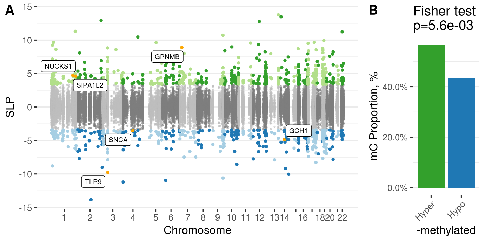
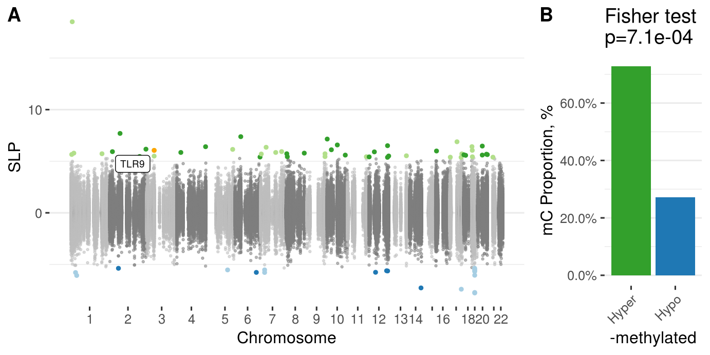

<!-- # (c)  Juozas Gordevičius -->

```{r setup, include=FALSE}
source("../code/common.R")
```

# Stats for Results Section


## OFB 

```{r}
ofbx <- fread("../Brain_OFB_Padlock_CGonly/www/m6_Brain_OFB_Padlock_CGonly.csv")
ofbd <- readRDS("../Brain_OFB_Padlock_CGonly/www/m6_methylation.RDS")
```

```{r, include=TRUE}
message("Number of loci ", nrow(ofbx))

message("Cases and controls: ")
print(ofbd$key[, table(Group)])

message("Number of significant loci ", 
	ofbx[, sum(adj.P.Val < 0.05, na.rm=TRUE)])

message("Number of genes affects ",
	ofbx[adj.P.Val < 0.05, length(unique(Gene))])
```

Hyper-methylation of OFB 

```{r, include=TRUE}
ofbx[, table(adj.P.Val < 0.05, sign(logFC))] %>% tee %>% fisher.test
```

## PFC (large)

```{r}
pfcx <- fread("../Brain_PFCRep_Padlock_withGLU/www/m6_Brain_PFCRep_Padlock_withGLU.csv")
pfcd <- readRDS("../Brain_PFCRep_Padlock_withGLU/www/m6_methylation.RDS")
```

```{r, include=TRUE}
message("Number of loci ", nrow(pfcx))
message("Number of CG and non-CG loci:")
pfcx[, table(Type == "CG")] %>% print

message("Cases and controls: ")
print(pfcd$key[, table(Group)])

message("Number of significant loci ", 
	pfcx[, sum(adj.P.Val < 0.05, na.rm=TRUE)])

message("Number of genes affected ",
	pfcx[adj.P.Val < 0.05, length(unique(Gene))])
```

Hyper-methylation of PFC

```{r, include=TRUE}
pfcx[, table(adj.P.Val < 0.05, sign(logFC))] %>% tee %>% fisher.test
```

## PFC (large) stage-wise

```{r, include=TRUE}
stagex <- fread("../Brain_PFCRep_Padlock_withGLU_Braak/www/m6_Brain_PFCRep_Padlock_withGLU_Braak.csv")
contrasts <- c(
  "StageEarly - StageControl",
  "StageLate - StageControl"
  )

for (contrast in contrasts) {
  message(contrast)
  colP <- paste0("P.", contrast)
  message("Number of significant loci ", 
    stagex[, sum(p.adjust(get(colP), "fdr") < 0.05, na.rm=TRUE)])

  message("Number of genes affected ",
    stagex[p.adjust(get(colP), "fdr") < 0.05, length(unique(Gene))])
}
```

Overlap of each contrast with the general result

```{r}
dt <- 
foreach(contrast = contrasts, .combine = rbind) %do% {
  colP <- paste0("P.", contrast)
  A <- pfcx[, list(ID, Significant = adj.P.Val < 0.05)]
  B <- stagex[, list(ID, Significant = p.adjust(get(colP), "fdr") < 0.05)]
  merge(A, B, by = "ID") %>%
  .[, table(Significant.x, Significant.y)] %>%
  fisher.test() %>%
  broom::tidy() %>% 
  select(estimate, p.value) %>%
  setDT %>% 
  .[, Contrast := contrast]
}
```

```{r, include=TRUE}
dt
```

Does the absolute effect increase in late stage compared to early stage?

```{r, include=TRUE}
stagex[, list(
    A = get("C.StageEarly - StageControl"), 
    pA = get("P.StageEarly - StageControl"), 
    B = get("C.StageLate - StageControl"),
    pB = get("P.StageLate - StageControl")
  )] %>%
.[pA < 0.05 & pB < 0.05, t.test(abs(A), abs(B), paired = TRUE)]

```


## Overlap of APX and Brain

```{r, include=TRUE}
apx <- fread("../Appendix_PDvsControls_Padlock/www/m6_Appendix_PDvsControls_Padlock.csv")

A <- apx[ , sum(adj.P.Val < 0.05, na.rm=TRUE), list(Gene=toupper(Gene))]
B <- pfcx[ , sum(adj.P.Val < 0.05, na.rm=TRUE), list(Gene=toupper(Gene))]
C <- ofbx[ , sum(adj.P.Val < 0.05, na.rm=TRUE), list(Gene=toupper(Gene))]

message("Appendix with OFB:")
merge(A, C, by = "Gene") %>% .[, table(V1.x > 0, V1.y > 0)] %>% fisher.test

message("Appendix with PFC:")
merge(A, B, by = "Gene") %>% .[, table(V1.x > 0, V1.y > 0)] %>% fisher.test

```

## PFC replication (small)

```{r}
pfc2x <- fread("../Brain_PFC_Padlock_CGonly/www/m6_Brain_PFC_Padlock_CGonly.csv")
pfc2d <- readRDS("../Brain_PFC_Padlock_CGonly/www/m6_methylation.RDS")
```


```{r, include=TRUE}
message("Number of loci ", nrow(pfc2x))

message("Cases and controls: ")
print(pfc2d$key[, table(Group)])

message("Number of significant loci ", 
	pfc2x[, sum(adj.P.Val < 0.05, na.rm=TRUE)])

message("Number of genes affects ",
	pfc2x[adj.P.Val < 0.05, length(unique(Gene))])
```


Hyper-methylation of PFC

```{r, include=TRUE}
pfc2x[, table(adj.P.Val < 0.05, sign(logFC))] %>% tee %>% fisher.test
```

## Overlap of APX and Brain PFC II

```{r, include=TRUE}
A <- apx[ , sum(adj.P.Val < 0.05, na.rm=TRUE), list(Gene=toupper(Gene))]
D <- pfc2x[ , sum(adj.P.Val < 0.05, na.rm=TRUE), list(Gene=toupper(Gene))]


message("Appendix with PFC:")
merge(A, D, by = "Gene") %>% .[, table(V1.x > 0, V1.y > 0)] %>% fisher.test

```

## PD Hallmarks

```{r}
p_load("RobustRankAggreg")

computeORs <- function(dt) {
  dt <- 
    foreach (gene = unique(dt$Gene), .combine = rbind) %dopar% {
      require(data.table)
      tryCatch({
        t <- dt[, table(Gene == gene, Significant == TRUE)]
        f <- fisher.test(t, alternative = "greater")
        data.table(OR = f$estimate, P = f$p.value, Gene = gene)    
      }, error = function(e) {
        message(e)
        data.table(OR = NA, P = NA, Gene = gene)
      })
    }
  dt
}

epfcr <- withCluster(computeORs(pfc2x[, list(Gene, Significant = adj.P.Val < 0.05)]), nNodes = 10)
epfc  <- withCluster(computeORs(pfcx[, list(Gene, Significant = adj.P.Val < 0.05)]), nNodes = 10)
eofb  <- withCluster(computeORs(ofbx[, list(Gene, Significant = adj.P.Val < 0.05)]), nNodes = 10)
eapp  <- withCluster(computeORs(apx[, list(Gene, Significant = adj.P.Val < 0.05)]), nNodes = 10)
hallmarks <- aggregateRanks(
  list(
    # epfcr[order(P), Gene],
    epfc[order(P), Gene],
    eofb[order(P), Gene],
    eapp[order(P), Gene]
  )
)  
setDT(hallmarks)
setnames(hallmarks, "Name", "Gene")
hallmarks <- 
merge(hallmarks, epfcr[, list(Gene, PFCII.OR=OR, PFCII.P=P)], by = "Gene") %>% 
		merge(., epfc[, list(Gene, PFC.OR=OR, PFC.P=P)], by = "Gene") %>%
		merge(., eofb[, list(Gene, OFB.OR=OR, OFB.P=P)], by = "Gene") %>%
		merge(., eapp[, list(Gene, APP.OR=OR, APP.P=P)], by = "Gene")

if (!dir.exists("www")) dir.create("www")
write.table(hallmarks[order(Score)], file = "www/PD_Hallmarks.csv", sep = ",", row.names = FALSE)

hallmarks2 <- aggregateRanks(
  list(
    epfcr[order(P), Gene],
    epfc[order(P), Gene],
    eofb[order(P), Gene],
    eapp[order(P), Gene]
  )
)  
setDT(hallmarks2)
setnames(hallmarks2, "Name", "Gene")
hallmarks2 <- 
merge(hallmarks2, epfcr[, list(Gene, PFCII.OR=OR, PFCII.P=P)], by = "Gene") %>% 
    merge(., epfc[, list(Gene, PFC.OR=OR, PFC.P=P)], by = "Gene") %>%
    merge(., eofb[, list(Gene, OFB.OR=OR, OFB.P=P)], by = "Gene") %>%
    merge(., eapp[, list(Gene, APP.OR=OR, APP.P=P)], by = "Gene")

if (!dir.exists("www")) dir.create("www")
write.table(hallmarks2[order(Score)], file = "www/PD_Hallmarks2.csv", sep = ",", row.names = FALSE)


```

```{r, include=TRUE}
hallmarks[order(Score)][1:40]
```


# Supplementary figures

## Supp. Fig. Brain 2

```{r, include=TRUE, fig.cap="Manhattan plot of OFB"}

```

## Supp. Fig. Brain 3

```{r, include=TRUE, fig.cap="Manhattan plot of PFC"}

```


# Supplementary tables


```{r}
url <- "../Brain_OFB_Padlock_CGonly/www/m6_Brain_OFB_Padlock_CGonly.csv"
stopifnot(file.exists(url))
```

- [Supp. table 3](`r url`) OFB fits

```{r}
url <- "../Brain_PFCRep_Padlock_withGLU/www/m6_Brain_PFCRep_Padlock_withGLU.csv"
stopifnot(file.exists(url))
```

- [Supp. table 4](`r url`) PFC (large) fits


```{r}
url <- "../Brain_PFCRep_Padlock_withGLU_Braak/www/m6_Brain_PFCRep_Padlock_withGLU_Braak.csv"
stopifnot(file.exists(url))
```

- [Supp. table 5](`r url`) PFC (large) fits with contrasts for different Braak stages


```{r}
url <- "../Brain_PFC_Padlock_CGonly/www/m6_Brain_PFC_Padlock_CGonly.csv"
stopifnot(file.exists(url))
```

- [Supp. table 6](`r url`) PFC II (small) fits

```{r}
url <- "./www/PD_Hallmarks.csv"
stopifnot(file.exists(url))
```

- [Supp. table 7](`r url`) PD Hallmark genes


