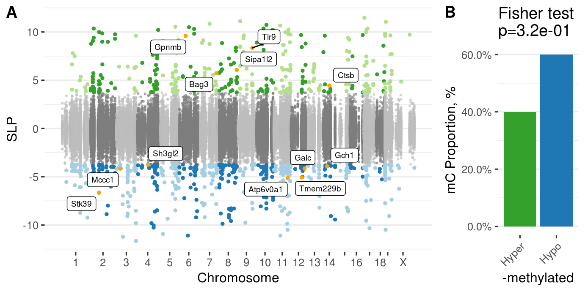

<!-- # (c)  Juozas Gordevičius -->

```{r setup, include=FALSE}
source("../code/common.R")

gmap <- fread("../etc/padlock_genes_human2mouse.csv") %>%
  select(V1, V2)
gmap[1, ] %>% as.character %>% setnames(gmap, .)
gmap <- gmap[-1,]
```

# Stats for Results Section

```{r}
cpx <- fread("../Mice_CecalPatch_Padlock/www/m6_Mice_CecalPatch_Padlock.csv")
dssx <- fread("../Mice_DSS_Padlock/www/m6_Mice_DSS_Padlock.csv")
apx <- fread("../Appendix_PDvsControls_Padlock/www/m6_Appendix_PDvsControls_Padlock.csv")
```

## DSS

```{r, include=TRUE}
message("Number of loci ", nrow(dssx))
```

In wildtype 

```{r, include=TRUE}
colP <- "P.GTwt_DSS - GTwt_Water"
message("Number of significant  loci ", 
	dssx[, sum(p.adjust(get(colP), "fdr") < 0.05, na.rm=TRUE)])

message("Number of affected genes ", 
	dssx[p.adjust(get(colP), "fdr") < 0.05, length(unique(Gene))])

```

In A30P

```{r, include=TRUE}
colP <- "P.GTtg_DSS - GTtg_Water"
message("Number of significant  loci ", 
	dssx[, sum(p.adjust(get(colP), "fdr") < 0.05, na.rm=TRUE)])

message("Number of affected genes ", 
	dssx[p.adjust(get(colP), "fdr") < 0.05, length(unique(Gene))])

```


Direction enrichment in wildtype

```{r, include=TRUE}
colP <- "P.GTwt_DSS - GTwt_Water"
colC <- "C.GTwt_DSS - GTwt_Water"
dssx[, table(p.adjust(get(colP), "fdr") < 0.05, -sign(get(colC)))] %>% tee %>% fisher.test
```

Direction enrichment in A30P

```{r, include=TRUE}
colP <- "P.GTtg_DSS - GTtg_Water"
colC <- "C.GTtg_DSS - GTtg_Water"
dssx[, table(p.adjust(get(colP), "fdr") < 0.05, -sign(get(colC)))] %>% tee %>% fisher.test
```


Differences between WT and A30P DSS treatment effects

```{r, include=TRUE}
colA <- "C.GTwt_DSS - GTwt_Water"
colB <- "C.GTtg_DSS - GTtg_Water"
dssx[, list(get(colA), get(colB))] %>% 
	.[, t.test(V1, V2, paired = TRUE)]
```


## Cecal patch

```{r, include=TRUE}
message("Number of loci ", nrow(cpx))

message("Number of significant loci ", 
	cpx[, sum(adj.P.Val < 0.05, na.rm=TRUE)])

message("Number of genes affects ",
	cpx[adj.P.Val < 0.05, length(unique(Gene))])


```

## Enrichment of pathways

Get the genes that have more than 1 DMC in each of the datasets: apx, cp, dss and then
ask if a) gene belongs to pathway x, b) gene is DMC in two chosen datasets.


```{r}
# Mouse GO 
getGoGenes <- function(term) {
  url <- glue("http://www.informatics.jax.org/go/report.txt?goID={term}&results=1000&startIndex=0&sort=term&dir=")
  genes <- fread(url)
  genes[, `MGI Gene/Marker ID`] %>% unique
}


pathways <- list(
  list(term="GO:0061912", name="Selective autophagy"),
  list(term="GO:0016236", name="Macroautophagy"),
  list(term="GO:0005764", name="Lysosomes"),
  list(term="GO:0061684", name="Chaperone-mediated autophagy"),
  list(term="GO:0006914", name="Autophagy")
  # list(term="GO:0016237", name="Microautophagy"),
  # list(term="GO:0000423", name="Mitophagy")
  )

pathways_mouse <- foreach(p = pathways) %do% {
  p$genes <- getGoGenes(p$term)
  p
}

# Human go
getGoGenes <- function(term) {
  url <- glue("http://golr-aux.geneontology.io/solr/select?defType=edismax&qt=standard&indent=on&wt=csv&rows=100000&start=0&fl=bioentity_name,bioentity,bioentity_label&facet=true&facet.mincount=1&facet.sort=count&json.nl=arrarr&facet.limit=25&hl=true&hl.simple.pre=%3Cem%20class=%22hilite%22%3E&hl.snippets=1000&csv.encapsulator=&csv.separator=%09&csv.header=false&csv.mv.separator=%7C&fq=regulates_closure:%22{term}%22&fq=document_category:%22bioentity%22&fq=taxon_subset_closure_label:%22Homo%20sapiens%22&facet.field=source&facet.field=taxon_subset_closure_label&facet.field=type&facet.field=panther_family_label&facet.field=annotation_class_list_label&facet.field=regulates_closure_label&q=*:*")
  genes <- fread(url, header = FALSE)
  return(genes$V3)
}

pathways <- list(
  list(term="GO:0061912", name="Selective autophagy"),
  list(term="GO:0016236", name="Macroautophagy"),
  list(term="GO:0005764", name="Lysosomes"),
  list(term="GO:0061684", name="Chaperone-mediated autophagy"),
  list(term="GO:0006914", name="Autophagy")
  # list(term="GO:0016237", name="Microautophagy"),
  # list(term="GO:0000423", name="Mitophagy")
  )

pathways_human <- foreach(p = pathways) %do% {
  p$genes <- getGoGenes(p$term)
  p
}

rm(pathways)

myContrasts <- c(
  "GTwt_DSS - GTwt_Water",
  "GTtg_DSS - GTwt_Water",
  "GTtg_DSS - GTtg_Water",
  "GTtg_Water - GTwt_Water")


##### Table that stores the count of the number of DMCs in each gene
dt <- apx[, list(APX = sum(adj.P.Val < 0.05, na.rm=TRUE)), Gene]
dt <- merge(dt, gmap, by.x = "Gene", by.y = "HGNC_hg19") 
dt <- dt[, list(Gene_Mouse = MGI_mm10, Gene_Human=Gene, APX)]
dt <- merge(
  dt,
  cpx[, list(CecalPatch = sum(adj.P.Val < 0.05, na.rm=TRUE)), Gene], 
  by.x = "Gene_Mouse", by.y = "Gene")
foreach (contrast = myContrasts) %do% {
  colP <- glue("P.{contrast}")
  colC <- glue("C.{contrast}")

  dt <- 
    dssx[, list(C = sum(p.adjust(get(colP), "fdr") < 0.05, na.rm=TRUE)), Gene] %>%
    setnames(., "C", contrast) %>%
    merge(dt, ., by.x = "Gene_Mouse", by.y = "Gene")
  return(NULL)
}

fwrite(dt, "www/GeneDMCCounts.csv")

```

Take the genes that have more than 1 DMCs in both appendix and mouse dataset and test which pathways are enriched.

```{r}
res <- 
  foreach( p = pathways_human, .combine = rbind) %do% {
    genes <- p$genes

    res1 <- dt[, table(APX > 1 & CecalPatch > 1, Gene_Human %in% genes)] %>%
            fisher.test %>%
            broom::tidy() %>% 
            select(estimate, p.value, conf.low, conf.high) %>%
            setDT %>%
            .[, Test := sprintf('rAAV \u03B1-syn')] %>%
            .[, Pathway := p$name]
    res2 <- dt[, table(APX > 1 & `GTtg_DSS - GTtg_Water` > 1, Gene_Human %in% genes)] %>%
            fisher.test %>%
            broom::tidy() %>% 
            select(estimate, p.value, conf.low, conf.high) %>%
            setDT %>%
            .[, Test := "A30P_DSS - A30P_Water"] %>%
            .[, Pathway := p$name]
    res3 <- dt[, table(APX > 1 & `GTwt_DSS - GTwt_Water` > 1, Gene_Human %in% genes)] %>%
            fisher.test %>%
            broom::tidy() %>% 
            select(estimate, p.value, conf.low, conf.high) %>%
            setDT %>%
            .[, Test := "WT_DSS - WT_Water"] %>%
            .[, Pathway := p$name]
    res4 <- dt[, table(APX > 1 & `GTtg_DSS - GTwt_Water` > 1, Gene_Human %in% genes)] %>%
            fisher.test %>%
            broom::tidy() %>% 
            select(estimate, p.value, conf.low, conf.high) %>%
            setDT %>%
            .[, Test := "A30P_DSS - WT_Water"] %>%
            .[, Pathway := p$name]
           
    res5 <- dt[, table(APX > 1 & `GTtg_Water - GTwt_Water` > 1, Gene_Human %in% genes)] %>%
            fisher.test %>%
            broom::tidy() %>% 
            select(estimate, p.value, conf.low, conf.high) %>%
            setDT %>%
            .[, Test := "A30P_Water - WT_Water"] %>%
            .[, Pathway := p$name]
    rbindlist(list(res1, res2, res3, res4, res5))
  }

```

```{r, include=TRUE}
res[p.value < 0.05]
```

Take the genes that have more than 1 DMC in both cecal patch experiment and other DSS contrast and test which pathways are enriched.

```{r}
res2 <-
  foreach( p = pathways_mouse, .combine = rbind) %do% {
    genes <- p$genes

    res2 <- dt[, table(CecalPatch > 1 & `GTtg_DSS - GTtg_Water` > 1, Gene_Mouse %in% genes)] %>%
            fisher.test %>%
            broom::tidy() %>% 
            select(estimate, p.value, conf.low, conf.high) %>%
            setDT %>%
            .[, Test := sprintf("A30P_DSS - A30P_Water")] %>%
            .[, Pathway := p$name]
    res3 <- dt[, table(CecalPatch > 1 & `GTwt_DSS - GTwt_Water` > 1, Gene_Mouse %in% genes)] %>%
            fisher.test %>%
            broom::tidy() %>% 
            select(estimate, p.value, conf.low, conf.high) %>%
            setDT %>%
            .[, Test := sprintf("WT_DSS - WT_Water")] %>%
            .[, Pathway := p$name]
    res4 <- dt[, table(CecalPatch > 1 & `GTtg_DSS - GTwt_Water` > 1, Gene_Mouse %in% genes)] %>%
            fisher.test %>%
            broom::tidy() %>% 
            select(estimate, p.value, conf.low, conf.high) %>%
            setDT %>%
            .[, Test := sprintf("A30P_DSS - WT_Water")] %>%
            .[, Pathway := p$name]
           
    res5 <- dt[, table(CecalPatch > 1 & `GTtg_Water - GTwt_Water` > 1, Gene_Mouse %in% genes)] %>%
            fisher.test %>%
            broom::tidy() %>% 
            select(estimate, p.value, conf.low, conf.high) %>%
            setDT %>%
            .[, Test := sprintf("A30P_Water - WT_Water")] %>%
            .[, Pathway := p$name]
    rbindlist(list(res2, res3, res4, res5))
  }

```

```{r, include=TRUE}
res2[p.value < 0.05]
```

```{r}
res[, Study := "PD appendix vs mice studies"]
res2[, Study := sprintf("rAAV-\u03B1-syn vs\nDSS study")]
pd <- rbind(res, res2)

p1 <- ggplot(pd, aes(Pathway, log(estimate), color = p.value < 0.05, shape = Test)) + 
      geom_jitter(size = 3, width = 0.2) + 
      geom_hline(yintercept = 0) + 
      ylab("OR, log") + 
      facet_wrap(~ Study) + 
      scale_shape_discrete("") + 
      scale_color_manual("p", values = c("grey30", "red"), labels = c("> 0.05", "< 0.05")) + 
      theme_bw(base_size = 12) + 
      theme(
        axis.title.x = element_blank(),
        axis.text.x = element_text(angle = 45, hjust = 1))


```


## Correlation of enrichments in CecalPatch and DSS

```{r, include=TRUE}
dt <- fread("../Discover_OverlapAppendixMice/ORs_CecalPatch_DSS.csv")
dt
```


```{r}
# Compute enrichment of genes in mice data
computeORs <- function(dt) {
  dt <- 
    foreach (gene = unique(dt$Gene), .combine = rbind) %dopar% {
      require(data.table)
      tryCatch({
        t <- dt[, table(Gene == gene, Significant == TRUE)]
        f <- fisher.test(t, alternative = "greater")
        data.table(OR = f$estimate, P = f$p.value, Gene = gene)    
      }, error = function(e) {
        message(e)
        data.table(OR = NA, P = NA, Gene = gene)
      })
    }
  dt
}

ecp <- withCluster(computeORs( cpx[, list(Gene, Significant = adj.P.Val < 0.05)]), nNodes = 10)
setnames(ecp, c("OR", "P"), paste0(c("OR.", "P."), "CP"))
myContrasts <- c(
  "GTwt_DSS - GTwt_Water",
  "GTtg_DSS - GTwt_Water",
  "GTtg_DSS - GTtg_Water",
  "GTtg_Water - GTwt_Water")

edss <- foreach( cont = myContrasts) %do% {
	colP <- paste0("P.", cont)
	e <- withCluster(computeORs( dssx[, list(Gene, Significant = p.adjust(get(colP), "fdr") < 0.05)]), nNodes = 10)	
	setnames(e, c("OR", "P"),
		paste0(c("OR.", "P."), cont))
	e
}


dt <- merge(ecp, edss[[1]], by = "Gene") %>%
  	  merge(., edss[[2]], by = "Gene") %>%
	  merge(., edss[[3]], by = "Gene") %>%
	  merge(., edss[[4]], by = "Gene")
if (!dir.exists("www")) dir.create("www")
write.table(dt, file = "www/Mice_Gene_Enrichment.csv", sep = ",", row.names = FALSE)

```

## Correlation of Mice and appendix

```{r, include=TRUE}
dt <- fread("../Discover_OverlapAppendixMice/ORs_Appendix_Mice.csv")
dt
```

```{r}


eapx <- withCluster(computeORs( apx[, list(Gene, Significant = adj.P.Val < 0.05)]), nNodes = 10)


dt <- merge(eapx, gmap, by.x = "Gene", by.y = "HGNC_hg19")
if (!dir.exists("www")) dir.create("www")
write.table(dt, file = "www/Appendix_Gene_Enrichment.csv", sep = ",", row.names = FALSE)

```


# Supplementary figures


## Supp. Fig. Mice 5

MARKUS data

## Supp. Fig. Mice 6

MARKUS data

## Supp. Fig. Mice 7


```{r, include=TRUE, fig.cap="Manhattan plot for wild type vs A30P mice"}
knitr::include_graphics("../Mice_DSS_Padlock/index_files/figure-html/unnamed-chunk-31-4.png")
```

## Supp. Fig. Mice 8

```{r, include=TRUE, fig.cap="Manhattan plot for CP (rAAV-syn) - control (rAAV-GFP)"}

```

## Supp. Fig. Mice 9

```{r, include=TRUE, fig.cap="Enrichment of pathways with genes that overlap in Appendix and Mice"}
p1
```


# Supplementary tables

```{r}
url <- "../Mice_DSS_Padlock/www/m6_Mice_DSS_Padlock.csv"
stopifnot(file.exists(url))
```

- [Supp. table 13](`r url`) Mice DSS fits

```{r}
url <- "../Mice_CecalPatch_Padlock/www/m6_Mice_CecalPatch_Padlock.csv"
stopifnot(file.exists(url))
```

- [Supp. table 14](`r url`) Mice CP fits


```{r}
url <- "./www/Mice_Gene_Enrichment.csv"
stopifnot(file.exists(url))
```

- [Supp. table 15](`r url`) Enrichment of genes with DMCs in Mice


```{r}
# url <- "./www/GeneDMCCounts.csv"
# stopifnot(file.exists(url))
```

<!-- - [Supp. table Mice 12](`r url`) Number of DMCs per gene in appendix, a-syn and DSS studies -->