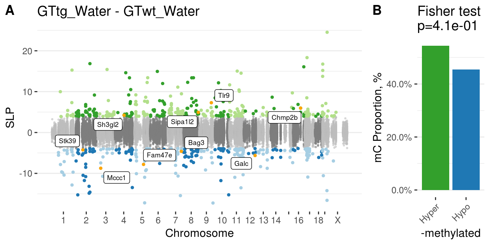

<!-- # (c)  Juozas Gordevičius -->


```{r, echo = FALSE, include = FALSE}
source("../code/common.R")
```


# Mice 

```{r, include=TRUE, fig.cap="Manhattan plot for wild type vs A30P mice"}

```

```{r, include=TRUE, fig.cap="Manhattan plot for CP (rAAV-syn) - control (rAAV-GFP)"}
knitr::include_graphics("../Mice_CecalPatch_Padlock/index_files/figure-html/unnamed-chunk-31-1.png")
```


